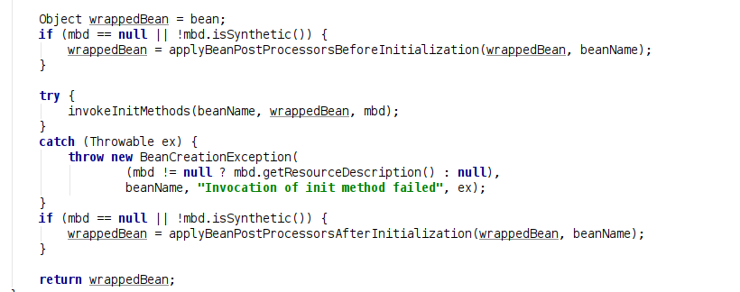

# spring
## 第一节课
### 1. IOC容器相关 (org.springsource.course1.cap1, org.springsource.course1.cap2)
IOC容器其实就是个很大的map集合  
IOC容器: 多实例->仅当bean被使用时才创建  
        单实例->创建IOC容器时bean就被创建

直接使用`@Bean`默认是单例模式的bean, 如果想指定以多例模式创建bean, 在`@Bean`注解之前(或者之后)加上
`@Scope(value="prototype")`注解. *注: 单例模式: @Scope(value="singleton")*  
使用`@ComponentScan`注解定义扫描类型时, 如果使用到自定义过滤器`@ComponentScan.@Filter`时, includeFilter use false
要不然使用默认的加载会失败.  
`@ComponentScan` 会将 `@Controller`, `@Service`, `@Repository`, `@Conponent`都扫描进来.  
@Scope(value = "")//scope的value四个取值
1. prototype: 多实例, IOC容器启动的时候,IOC容器并不会去调用方法创建对象, 而是每次获取的时候才会调用方法创建对象.  
2. singleton: 单实例(默认): IOC容器启动时会调用方法创建对象并且放入到IOC容器中, 以后每次获取就是直接从IOC容器中拿对象(Map.get())  
4. request: 主要针对web应用, 递交一次请求创建一个实例  
5. session: 同一个session创建了一个实例
### 2. 懒加载 (org.springsource.course1.cap3)
懒加载: 主要针对单实例bean, 默认容器启动时创建bean, 指定懒加载(@Lazy)时, 容器启动的时候不创建对象,仅当第一次使用(或者获取)
时创建bean.
## 第二节课
### 条件注册bean (org.springsource.course1.cap4)
> 其实IOC就是对我们的bean进行注册管理实例化, 因此会讲很多关于bean的管理的知识点.

有些情况下, 我们需要选择性的注入一些bean, 比如使用条件过滤, 在Windows下注入一些bean, 在Linux下注入另外一些bean, 此时就会使用到
条件注册bean功能

FactoryBean, BeanFactory区别?  
--> FactoryBean是一种注册机制, 可以把我们java实例bean通过factoryBean注入到容器中.  
--> BeanFactory: 从我们容器中获取到实例化后的bean.  
### 手动添加组件到IOC容器(Spring注册Bean的多种注册方式)
3. @Import: [快速给容器导入一个组件] 注意: @Bean有点简单粗暴.
   3.1 `@Import()`导入容器中的组件, 容器会自动注册这个组件, bean的id为全类名.
   3.2 ImportSelector: 是一个接口, 返回需要导入到容器的组件的全类名.
   3.3 ImportBeanDefinitionRegistrar: 可以手动加组件到IOC容器中, 所有Bean注册可以使用BeanDefinitionRegistrar
        定义一个类实现BeanDefinitionRegistrar接口即可.
`@Import()`导入容器中的组件, 容器会自动注册这个组件, bean的id为全类名, 其实就是实例化bean的另一种方式

4. 实现ImportBeanDefinitionRegistrar接口, 可以条件注册bean
```java
public class JamesImportBeanDefinitionRegistrar implements ImportBeanDefinitionRegistrar {
    /**
     * AnnotationMetadata: 当前注解类信息
     * @param importingClassMetadata 当前注解类信息
     * @param registry beanDefinition注册类,
     *                 作用: 把所有需要添加到容器中的bean加入
     */
    @Override
    public void registerBeanDefinitions(AnnotationMetadata importingClassMetadata, BeanDefinitionRegistry registry) {
        //实现功能: 只有当容器中有Dog和Cat对象时, 才向容器中加入Pig bean.
        boolean bean1 = registry.containsBeanDefinition("org.springsource.course1.cap5.Dog");
        boolean bean2 = registry.containsBeanDefinition("org.springsource.course1.cap5.Cat");
        //如果Dog和Cat同时存在于我们的IOC容器中, 那么创建Pig加入到容器中.
        if(bean1 && bean2){
            //对于我们要注册的bean, 给bean进行封装.
            //在底层源码中, 要想往容器中注册bean, 都会使用RootBeanDefinition类进行注册.
            BeanDefinition beanDefinition = new RootBeanDefinition("pig", Pig.class);
            registry.registerBeanDefinition("pig");
        }
    }
}
```
5. 使用Spring提供的FactoryBean(工厂bean)进行注册
## 第三节课 Bean的生命周期
### 初始化--销毁bean的三种方式
1. `@Bean(initMethod= , destroyMethod= )`
2. Bean类中实现 InitializingBean, DisposableBean接口
3. JSR250规范: `@PostConstruct`, `@PreDestroy`注解  
底层源码实现, 位置:org.springframework.beans.factory.support.AbstractAutowireCapableBeanFactory  


### 自定义bean后置处理器  
代码位置:`org.springsource.course1.cap9.JamesBeanPostProcessor`  
步骤:
1. 创建并初始化容器相关的所有processor
2. bean

### 关于Spring Bean后置处理器`BeanPostProcessor`
> 注意区分bean实现InitializingBean、DisposableBean接口和定义BeanPostProcessor的区别
定义一个类实现BeanPostProcessor接口后, 实现两个方法， beforeInitializer和afterInitializer方法， 是针对所有bean初始化处理。

其实对于`@Autowired`注解, 实际上是`AutowiredAnnotationBeanPostProcessor`类所完成的操作.  
Autowired----->AutowiredAnnotationBeanPostProcessor  注册到IOC容器  
bean----->控制我们的bean
